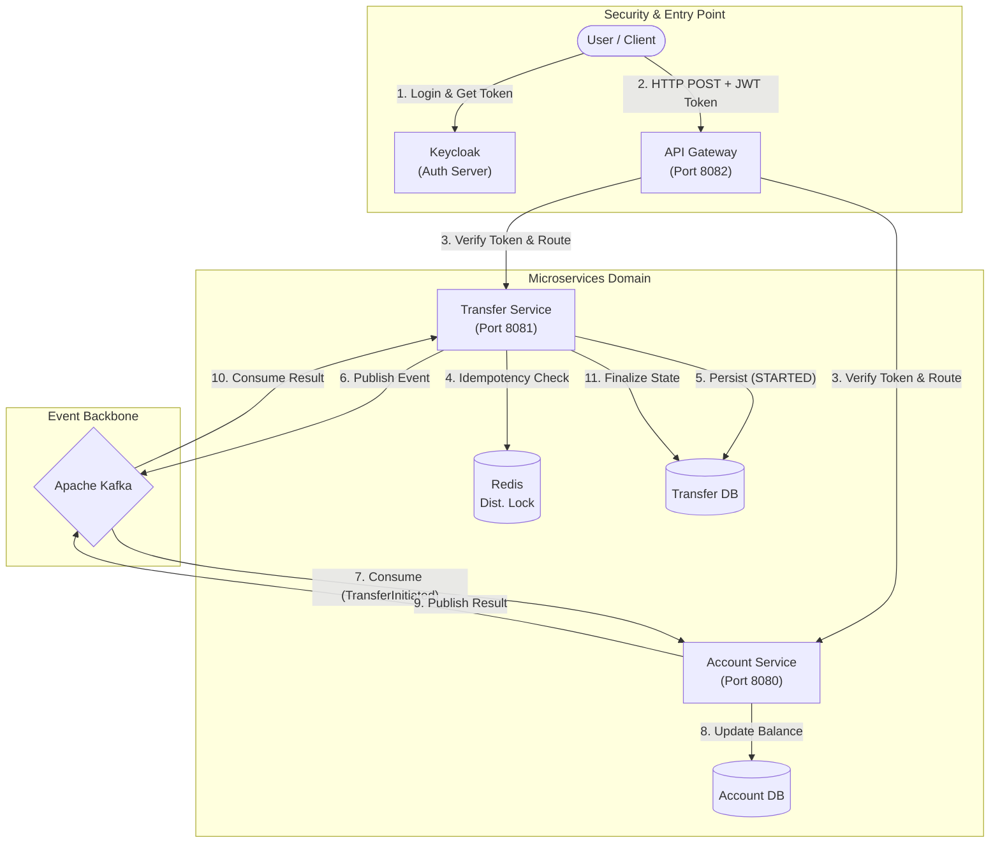
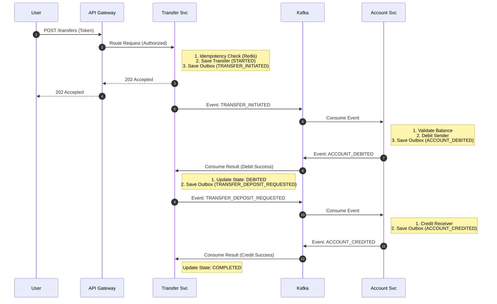
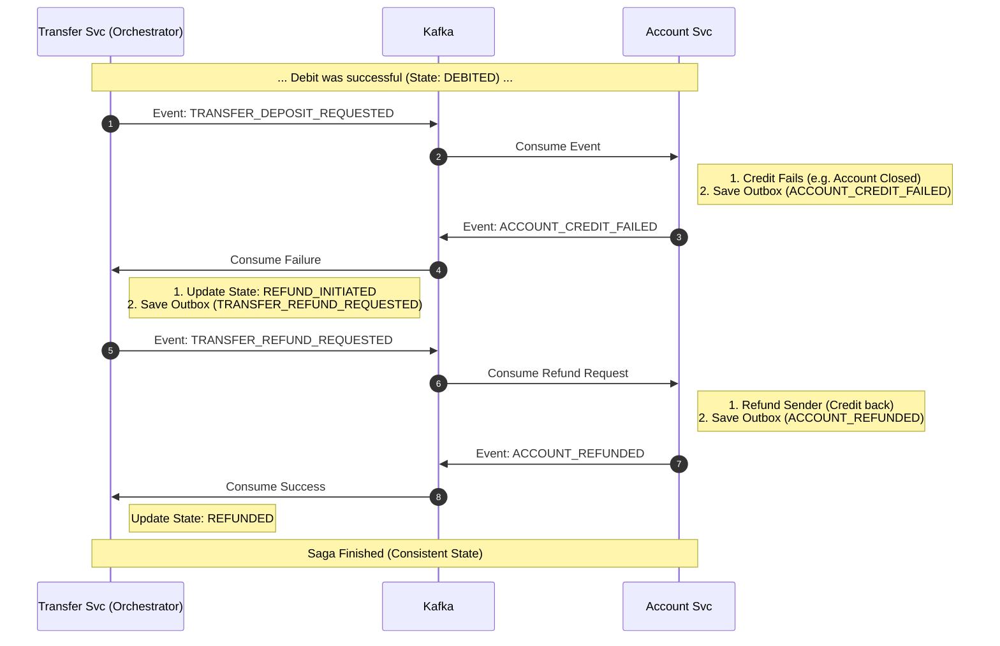

# Money Transfer Orchestrator (Reactive Saga Pattern)

[](https://www.oracle.com/java/)
[](https://spring.io/projects/spring-boot)
[](https://kafka.apache.org/)
[](https://www.docker.com/)

A high-performance, non-blocking, distributed money transfer system built with Spring Boot WebFlux and Kafka. It implements the Orchestration-based Saga Pattern to ensure eventual consistency across microservices without using 2PC (Two-Phase Commit).

This project demonstrates advanced distributed system concepts including Idempotency, Transactional Outbox Pattern, Optimistic Locking, and Compensation Transactions.

---

## Tech Stack

| Component | Technology | Description |
|-----------|-----------------|-------------|
| **Core** | Java 21 | Utilizes Records, Pattern Matching, and Virtual Threads (ready) for high performance. |
| **Framework** | Spring Boot 3.x | Built on **Spring WebFlux** for non-blocking, reactive I/O operations. |
| **Identity & Access** | **Keycloak** | Centralized Identity Provider (IdP) implementing **OAuth2 & OIDC** standards. |
| **API Gateway** | **Spring Cloud Gateway** | Reactive edge service for routing, filtering, and centralizing security policies. |
| **Security** | Spring Security | Acts as an **OAuth2 Resource Server** to validate JWT tokens at the microservice level. |
| **Database** | PostgreSQL | Accessed via **R2DBC** for fully reactive database interactions. |
| **Messaging** | Apache Kafka | Event streaming platform managed via **Spring Cloud Stream** for decoupled communication. |
| **Caching & Locking** | Redis | Used for distributed locking (Redlock) and idempotency checks. |
| **Observability** | Zipkin & Micrometer | Distributed tracing to visualize the saga flow and latency. |
| **Testing** | Testcontainers | Integration tests using real Docker containers (Kafka, Postgres, Keycloak). |
| **API Docs** | OpenAPI (Swagger) | Interactive API documentation integrated with **OAuth2 Security Flow**. |

---

## System Architecture

The system consists of two main microservices and an infrastructure layer.


---

## Saga Orchestration Flows

### 1. Happy Path (Successful Transfer)
The standard flow where both debit (sender) and credit (receiver) operations succeed.



### 2. Compensation Flow (Rollback Mechanism)
What happens if the money is debited from the sender, but the receiver's account is blocked or closed? The system automatically triggers a **Compensating Transaction** (Refund).


---

## Reliability & Infrastructure Patterns

To ensure eventual consistency and robust fault tolerance in a distributed environment, the system implements several industry-standard patterns.

### 1. Transactional Outbox Pattern (Guaranteed Delivery)
The system solves the **"Dual Write Problem"** (simultaneously updating the database and publishing to Kafka) by persisting events to an `outbox` table within the same ACID transaction as the business data.

* **Atomicity:** State changes and event creation happen atomically. If the database transaction fails, no event is generated.
* **Concurrency Safe Polling:** The background publisher uses `SELECT ... FOR UPDATE SKIP LOCKED`. This allows running multiple instances of the application without race conditions or duplicate event processing.

### 2. Multi-Layer Idempotency Strategy
Duplicate requests and events are handled at three distinct layers to ensure **exactly-once processing effects**:

* **Layer 1 (Fast Fail - Redis):** Uses `SETNX` (Atomic Lock) to instantly reject parallel requests with the same `idempotency-key` before they reach the database.
* **Layer 2 (Data Integrity - Database):** A unique constraint on the `transfers` table prevents duplicate records at the persistence level.
* **Layer 3 (Consumer Deduplication):** Consumers track processed transaction IDs in a `processed_transactions` table. If a Kafka message is redelivered, the consumer detects it and ignores the payload.

### 3. Resilience & Fault Tolerance
* **Exponential Backoff:** Transient failures (e.g., temporary broker downtime) trigger retries with increasing delays.
* **Dead Letter Queues (DLQ):** Messages that exceed the maximum retry count are automatically moved to a DLQ topic for manual inspection, preventing "poison pill" messages from blocking the consumption loop.

### 4. Self-Healing (Saga Reconciliation)
Protects against lost events and network failures to ensure consistency.

* **Stuck Transfer Scanner:** A background job detects transactions stuck in `DEBITED` or `REFUND_INITIATED` states.
* **Smart Recovery:** Automatically initiates a **Compensation Flow** (refund) for new failures or **Retries** the refund event for already compensating transactions.
* **Fail-Safe (Kill Switch):** To prevent infinite loops, transactions stuck beyond a hard limit (e.g., 1 hour) are marked as `FAILED` for manual intervention.

---

## Getting Started

### Prerequisites
- Docker & Docker Compose
- Java 21+
- Maven

### 1. Start Infrastructure
Run the following command to build the services and start the entire infrastructure (Kafka, Postgres, Keycloak, Gateway, Microservices):
```bash
docker-compose up -d --build
```

### 2. Authentication (Login)
The system uses Keycloak for Identity Management. A test user is automatically configured for the demonstration.

* Keycloak Console: http://localhost:8180 (admin/admin)
* Test User Credentials:
  * Username: test
  * Password: 12345

### 3. Accessing APIs
All external API requests are routed through the API Gateway (Port 8082). You must authenticate to perform operations.

#### Option A: Using Swagger UI (Recommended)
We have integrated OAuth2 "Password Flow" into Swagger. You can authorize directly within the browser without needing external tools.

1. Open Transfer Service Swagger: http://localhost:8081/webjars/swagger-ui/index.html
2. Click the Authorize (🔓) button.
3. Enter the credentials:
   * client_id: banking-client
   * username: test
   * password: 12345
   * client_secret: (leave empty)

4. Click Authorize and then Close. Now you can execute any endpoint directly from the UI.

#### Option B: Using Postman / cURL
If you prefer manual testing, you must first obtain a JWT Token and then send requests to the Gateway.
#### Step 1: Get Token
```http
POST http://localhost:8180/realms/banking-realm/protocol/openid-connect/token
Content-Type: application/x-www-form-urlencoded

client_id=banking-client
username=test
password=12345
grant_type=password
```

#### Step 2: Send Request (Via Gateway)
Use the ```access_token``` returned from the previous step as a Bearer Token.

```http
POST http://localhost:8082/api/v1/transfers
Authorization: Bearer <YOUR_ACCESS_TOKEN>
Content-Type: application/json

{
  "senderAccountId": "11111",
  "receiverAccountId": "22222",
  "amount": 100.00,
  "currency": "TRY"
}
```

---

## Testing Strategy

The project ensures reliability through a rigorous testing pyramid using Testcontainers.

* **End-to-End Saga Tests:** Simulates the full distributed transaction lifecycle (Debit -> Credit -> Completion) including compensation scenarios to ensure the orchestrator manages state correctly.
* **Resilience & Chaos Tests:** Verifies system recovery during infrastructure failures (e.g., Kafka Broker downtime, Database Locks) and validates the Retry/DLQ mechanisms.
* **Integration & Consumer Tests:** Validates R2DBC repositories, Outbox persistence, and Kafka Event Consumers to ensure contract integrity between services.

---

## Future Improvements

The following features are planned to move the system towards **Enterprise-Grade** readiness and complete the observability goals:

*  **Cloud-Native Deployment:** Migrating from Docker Compose to **Kubernetes** using **Helm Charts** to demonstrate scalable, production-ready deployment strategies.
*  **Advanced Chaos Engineering:** Integrating **Toxiproxy** to simulate network latency and connection cuts between microservices.